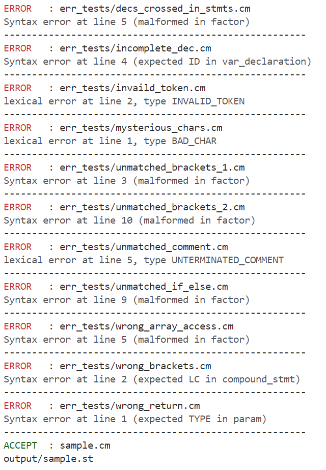

# meowCC

meowCC 是用 C 语言实现的一个 C-minus 小型解析器。它将 C-minus 源文件变为一个对应的 C-minus 语法分析树，并在源文件不符合 C-minus 的规约时报告错误。

## 整体设计

### 接口

如上述，meowCC 需要接受 C-minus 源文件作为输入，以语法分析树作为输出。为了便捷起见，可以将 meowCC 设计为一个 CLI 程序，具备如下命令行接口：

```text
meowCC [OPTIONS] SOURCE
Options:
  -h        Display help information.
  -d        Enable debug output.
  -l        Perform lexical analysis only.
  -e        View SOURCE as an C-minus expression.
  -i NUM    Set the indent of the output syntax tree (Default 0)
```

其中 `SOURCE` 是程序读入待解析源文件的路径，语法分析树则会被输出到程序的标准输出中（在默认情况下）。各个命令行选项及其意义如上所述，其中 `-l` 选项表示告诉程序只需输出对源文件进行词法分析后的 Token 序列，此时 `-e`，`-i` 选项无效。

根据命令行和 C 语言的规约，运行程序的命令被空格分开后以一个长度为 `argc` 的 `argv` 数组作为 `main` 函数的参数给出。为了实现上述命令行接口，需要解析 `argv` 数组中的命令行参数。

首先，设置一系列全局变量来保存命令行参数的解析结果，作为最终程序一侧的接口。

```c
// meow.c
FILE *source_fp; // SOURCE 所指定路径的文件对象指针。
int indent = 0; // -i 选项的参数，默认为零。
bool lexer_only = false, exp_only = false; // 是否设置了 -l, -e 选项。
bool debug_lexicon = false; // 是否设置了 -d 选项。
```

然后，使用 `getopt.h` 中的 `getopt()` 函数来提取命令行选项和选项对应的参数（如有），同时按照接口规范设置上述全局变量的值。在处理完命令行选项后，处理剩余的命令行参数并同样设置全局变量。实现见 `source/meow.c`。

### 架构

根据编译原理知识（如下图所示），解析任务可以被分为词法分析和语法分析两个环节。其中词法分析将源文件输入转换为词法单元序列（即 Token 序列），语法分析将 Token 序列转换为语法分析树。因此，meowCC 具有词法分析器（见 `source/lexer.c`）、语法分析器（见 `source/syntax.c`）两个模块，其输入输出分别如上所述。


同时，meowCC 还具有一个主模块 `source/meow.c`，其将数据在命令行接口及词法、语法分析器模块的接口间传递，并实际调用这些分析器，运行起整个解析流程。

下面就分别介绍 meowCC 的词法和语法分析器的设计与实现原理，以及它们被主模块所调用以完成任务的情况。

<!-- 选择 C 语言的原因
由于该解析器的组件关系并不复杂，不必使用面向对象的编程范式进行管理，从减少性能、内存和存储代价的角度起见，本次实验选定 C 语言作为开发语言。-->

## 词法分析

### 词法分析器的目标

从抽象层的角度来看，词法分析器接受源文件输入，并向语法分析器提供一个能够获取词法单元串（即 Token 序列）的接口。具体来说，词法分析就是在做如下两件事：

+ **分词**：将字符流组织成能被语法分析器利用的抽象 BNF 文法的终结符（即「词」）序列。
+ **识词**：根据每个词对应的词素，计算出词的语义属性或在符号表中记录，以供语义分析使用。

### 词法单元数据结构

作为词法分析的输出，词法单元的两要素：名称和属性分别对应了上述分词和识词任务的需求。

基于这一设计，在 meowCC 中，词法单元数据结构的实际实现是：

```c
// lexer.h
struct token_t {
    char name[64];        // 词法单元名，即词法单元的类型
    int lineno;	          // 行号，这是为了输出而保存的
    char value[64];       // 词素
};
```

在需要创建一个词法单元的时候，调用 `new_token` 函数，它接受行号，词法单元名，词法属性值，返回一个组织好的词法单元结构体。其实现见 `source/lexer.c`。

### 基于 DFA 的词法分析算法

在一个标准的编译器实现中，词法分析器的任务通常被分解为逐次从输入流中得到下一个词素/词法单元。因此，在实践上，需要构建一个能够接受且仅接受所有词素的 DFA（更准确的，希望 DFA 描述了所有合法的词素构成的语言）。该 DFA 从起始状态开始，持续接收缓冲区开头的字符进行转移，直到转移到死状态为止。在这一过程中，经过的每个终止状态都可以对应一个词素。

然后，为了识别出下一个词法单元，词法分析器还需要基于每个词法单元类型对应的模式，判别潜在词素应该对应哪一个词法单元类型，进而计算其属性。同时，当余下的输入缓冲区的多个前缀都能被 DFA 所接受时（即 DFA 在进入死状态以前，经过了多个终止状态），还需要判断应该哪个前缀应该被作为下一个词素进行处理，这时就需要得知词法单元设定的额外规则或词法单元类型之间的优先级等。

因此，需要通过划分终止状态集合，来让词法分析器能够通过终止状态来确定其对应的词法单元的种类，从而确定下一个词素并计算出词法单元的属性值。

> 需要说明的是，为了允许空白符、注释等存在，在本实验报告内也认为它们属于一种特殊的「无效」词法单元，对于这类词法单元，在识别出它们后并不将其作为下一个有效的词法单元返回给语法分析器。

目前已经有了通过正则表达式描述所有词法单元的模式并自动化构建满足条件的 DFA，甚至词法分析器的算法（及其实现，如 Flex 等）。但是在实用的场景下，由于词法分析器本身逻辑较为简单使得手工撰写较为容易，同时上述直接模拟 DFA 获取词素的算法不够灵活，仍然存在手工优化的空间，因此本次实验选择手工构造 DFA，并对 DFA 的利用算法做一些因地制宜的优化。

在实验目的部分已经阐述了源语言 C minus 的词法规则。可以发现，C minus 的词法规则是相对简单的，但是若要区分关键字和标识符，则将使得 DFA 大大复杂，并且很难手工设计，除非先设计 NFA，再将 NFA 转化为 DFA。但可以很快发现一点可以利用的性质：

在使用现实程序模拟 DFA 运行时，程序能够记录走到当前状态的路径，这意味着在达到终止状态时可以得到词素本身。进而，通过手工对词素进行判断就可以区分词素应当属于哪类词法单元。有了这个性质，就可以合并部分模式类似或互相包含的词法单元类型，例如：

+ 可以把 `+` `-` `*` 合并为算术符号（arithmetic）。
+ 可以把所有关键字和 ID 合并为 Word。
+ 可以把所有以等号结尾的词法单元合并为长比较符号（long_relop）。

同时，为了进一步简化程序编写，应当尽量让每个程序走到死状态前抵达的最后一个终止状态就是最终匹配的词素，这样就可以进行贪婪匹配：即**尽可能多地匹配输入缓冲区的前缀，记录最后一次经过的终止状态时的词素，在走入死状态的时候直接以它为下个词法单元的词素，在得到匹配的词素之后，先按照状态进行初步分类，如有必要再进行判断来最终确定下一个词法单元的种类**。幸运的是，在合并了一部分词法单元类型后，本次实验使用的词法规则可以做到这一点，以下就是本次实验建立的 DFA 图示：


还容易发现的一点是，对于那些没有出边的终止状态，它们实际上是可以被优化掉的——因为上一步决定转移到它们时，能匹配的词素其实就已经确定了，因而可以不用特别建立状态再循环一次（再把读入的字符还回缓冲区）。

到这里借助 DFA 的帮助，就得到了一个能够从输入流得到下一个词法单元的算法。

从理论上来讲，对于真正意义上词法单元的识别来说，上图所示 DFA 并不是完整的（因为还依靠程序对于词素的二次判断来识别出最终的词法单元）。事实上，在采用上述算法时，也很容易对使用的真实 DFA 建模：可以认为程序存储的「当前词素」也是状态的一部分，使得这个 DFA 延展出无限和上图同构的水平层（事实上不是无限的，只是「足够多」，因为在实际中，可以认为词法单元的长度是有限的）；而每次改变「当前词素」时，就在层间发生状态转移。

### 基于 DFA 的词法分析实现

下面来介绍 meowCC 如何通过实现上述的 DFA 来实现对于下一个词法单元的获取（即 `getToken` 函数，见于 `source/lexer.c`）。

#### 状态定义

用 `enum` 来定义所有 DFA 状态的类型（有些状态被优化了）：

```c
// lexer.c
typedef enum {
    START,
    SLASH,
    RELOP,
    ASSIGN,
    NUM,
    WORD,
    INCOMMENT,
    OUT,
    PANIC
} State;
```

#### 状态机实现

应用最简单的模拟状态机思路：用一个状态变量来保存当前状态，根据当前状态和 `fgetc` 获取的字符，利用转移函数来决定下一步将要转移到哪个状态（需要注意的是，需要在途中遇到换行符时增加行号）。

实现见 `source/lexer.c`。

#### 错误处理

词法分析可能出现四种错误：

+ `INVALID_TOKEN`。字母串和数字串没被其他词法单元隔开而直接接触。
+ `BAD_SHARP`。出现单个感叹号而不是 `!=`。
+ `BAD_CHAR`。在起始状态出现一个没有定义显式转移的字符。
+ `UNTERMINATED_COMMENT`。在出现 EOF 时，块状注释没有结束。
+ `UNEXPECTED_EOF`。在出现 EOF 时，上一个非注释词法单元没有结束。

在发生错误时，可以认为出现了一个名称为 `EXCEPTION`，值为错误类型名的词法单元（代码实现见上）。在检查 `getToken` 函数的返回值时，如果发现错误就按照错误类型进行报错，并以非零返回值退出程序。

可以证明，在以上四种错误没有发生时：

+ 在通过输入串转移进入死状态之前，一定至少经过一个终止状态（否则将产生 `BAD_CHAR` 或 `BAD_SHARP` 错误）。
+ 在通过输入串转移进入死状态之前，最后一次经过终止状态时对应的输入串前缀就是下一个词法单元对应的词素。

### 在主模块运行词法分析

实现了词法分析器以后，meowCC 主模块利用它逐次从源文件的字符输入流中获取下一个词法单元（Token），从而生成一个 Token 序列，并将 Token 序列保存在全局静态区，以供后续语法分析器使用。

实现见 `source/meow.c`。

## 语法分析

### 语法分析器的目标

语法分析器从词法分析器接取词法单元序列后，需要将将词法单元序列视作一个终结符串，根据文法还原出从起始符号到该串的文法解析树，将其作为语法分析树。

<!-- + **生成抽象语法树：**为了优化语法分析器的性能和满足特定分析方法对文法的约束，文法（产生式）可能被改写得难以直观体现出原先预想的语法结构。另外，文法还含有一些特定语言规约细节，这也不是在进一步进行语义分析和中间代码生成时需要的。因此，相比于语法分析树，更希望得到的是一个隐去了不必要细节，直接体现源代码的抽象语法结构的抽象语法树。
  这一抽象语法树的构造可以用 SDT 的方法在语法分析阶段实现，而不必真的生成语法分析树并遍历它。 -->

<!-- 由上所述，语法分析器在接取词法单元序列作为输入以后，最终输出是一个抽象语法树。 -->

### 语法分析树

#### 语法分析树定义

<!-- 抽象语法树的定义见龙书 2.5.1 节，这里不再详细描述。 -->

可以把语法分析树的节点分为两类：

+ 非叶节点即**符号节点**。这种节点本身的值<!-- 通常是语法结构的**运算符**，-->是在文法中<!--对应语法结构-->对应的符号，而其各个直接后代则是<!--语法结构运算符的各个运算分量，在文法中对应-->该符号一次推导出的各个符号或终结符。
+ 叶子节点即**终结符节点**。这种节点一般和词法分析的 Token 一一对应，在文法中是终结符，没有后代<!--，自身就是一个单独的语法单元结构-->，因此直接将它表示为一个 `token_t`。

综上所述，可以给出抽象语法树数据结构的实现：

```c
// syntax.h
// 符号节点实现
typedef struct symbol_t {
    char name[64];
    int lineno;
    int size;
    struct syntax_t** child; // 子节点
} symbol_t;

// 通用节点
typedef struct syntax_t {
    union {
        symbol_t symbol;  // 符号节点
        token_t token;    // 终结符节点，直接用 token_t
    };
    int type;
} syntax_t;

// type 的取值
#define SYMBOL 1
#define TOKEN 2
```

可以看出，每个符号节点下属的子树都对应一个符号一步步推导为对应终结符串的过程。因此，整个语法分析树就是以起始符号节点为根，对应从起始符号一步步推导到终结符序列的层级结构的树。

#### 语法分析树节点创建

终结符节点可以直接沿用 Token，而符号节点则需要根据符号名、行号、和各个子节点的列表进行创建。

实现见 `source/syntax.c`。

#### 语法分析树节点打印

要打印某节点下属的语法分析树，只需先打印该节点，再递归打印其各个子树（如有）即可。

实现见 `source/syntax.c`。

### 带预测的递归下降分析器

由于本次实验的产生式比较简单，可以使用自顶向下的递归下降的分析方法来得到语法分析树。

同时，为了保证递归下降的正确性，分析器在分析过程中将结合文法，通过向前扫描 Token 序列来保证每次分析只会尝试一条产生式。因此，此递归下降分析器是**带预测的**。

#### 一般的递归下降分析原理

##### 算法流程

具体来说，一般的递归下降分析器针对每个符号，都设计一个「从 Token 序列当前位置开始析取下一个该符号」的递归下降分析函数，它们最终返回析取出的符号的对应分析树的根节点。

这些函数的运作流程是这样的：

<!-- + 先根据开头的若干终结符（向前看符号）启发式地预测可能使用的产生式，此时可能仍有多个产生式，但保证它们具有相同的前缀。 -->
+ 列举并按固定优先级逐一尝试可能的产生式。
+ 对于每个产生式：
  + 分析器从产生式右侧的第一个符号或终结符开始，逐一试图从当前位置开始析取符号/终结符，记录析取得到的语法节点，并在析取的过程中，每拿走一个 Token 便将当前位置往后推进一个。
  + 如果成功获取了产生式右侧的所有符号/终结符，则意味着本次产生式尝试成功了。那么新创建一个函数对应符号的语法节点，将析取到的语法节点都作为新节点的子节点，这样便使得新的语法节点成为析取出的符号的对应分析树的根节点，然后返回该节点。
  + 在任何时候，如果析取一个符号/终结符失败，则意味着本次产生式尝试失败了。此时需要将当前位置设置回尝试以前的值（这意味着每次在尝试之前需要保存一次当前位置的值）。
+ 当最后一条产生式失败时，函数返回一个空语法单元（`NULL`），表示无法析取出这个符号。

在实际运行时，只需要将当前位置设置为 Token 序列的起始位置，并析取一个起始符号即可。

##### 错误处理

一个平凡的错误处理方案是在起始符号析取失败后返回错误，但是这样不利于定位错误的具体产生位置。因此，需要在析取时传入一个 `last` 变量，当其被设置为 `1` 时，表示本次析取是从起始符号开始，若干次的「最后一次」产生式尝试递归调用的，即本次析取失败会导致起始符号最终析取失败。

这样，只需要在 `last` 为真且发生终结符析取失败时报出错误，就可以保证报错发生在导致最终错误的最后一次且在递归意义上最深的符号析取尝试上。

#### 递归下降算法实现框架

首先实现一个递归下降算法的分析框架。

##### 函数定义

首先列出所有符号的递归下降分析函数。

```c
// syntax.h
syntax_t* program(bool last);
syntax_t* declaration_list(bool last);
syntax_t* declaration(bool last);
syntax_t* var_declaration(bool last);
syntax_t* fun_declaration(bool last);
syntax_t* params(bool last);
syntax_t* param_list(bool last);
syntax_t* param(bool last);
syntax_t* compound_stmt(bool last);
syntax_t* local_declarations(bool last);
syntax_t* statement_list(bool last);
syntax_t* statement(bool last);
syntax_t* expression_stmt(bool last);
syntax_t* selection_stmt(bool last);
syntax_t* iteration_stmt(bool last);
syntax_t* return_stmt(bool last);
syntax_t* expression(bool last);
syntax_t* var(bool last);
syntax_t* simple_expression(bool last);
syntax_t* additive_expression(bool last);
syntax_t* relop(bool last);
syntax_t* addop(bool last);
syntax_t* mulop(bool last);
syntax_t* term(bool last);
syntax_t* factor(bool last);
syntax_t* call(bool last);
syntax_t* args(bool last);
syntax_t* arg_list(bool last);
```

##### 获取单个终结符节点

`advance()` 函数实现了析取单个终结符，并将当前位置后移一位的操作：

##### 报错

可以实现一个报错的工具函数，以减少工作量。报错给出行号，出错原因和出现错误的符号。

##### `EOT`

为了方便，在 Token 序列的末尾添加一个类型为 `EOT` 的 Token。

##### 宏

可以将递归下降分析过程一些常用的代码片段包装成宏，以复用代码，减少错误。

```c
// syntax.c
#define current_token (token_list[current_token_cnt])
#define next_token (token_list[current_token_cnt + 1])
#define line_number (current_token->lineno)

/* 判断 TOKEN 的类型 */
#define istyp(TYPE) (strcmp(current_token->name, #TYPE) == 0)
#define istoktyp(TOKEN, TYPE) (strcmp(token_list[current_token_cnt + TOKEN]->name, #TYPE) == 0)
#define isnxttyp(TYPE) (strcmp(next_token->name, #TYPE) == 0)

/* 保存尝试产生式以前的开始位置 */
#define SAVE_CONT int cont = current_token_cnt
/* 恢复开始位置 */
#define RESTORE_CONT current_token_cnt = cont
/* last = false 时的析取失败 */
#define NONLAST_FAIL do {\
  assert(!last);\
  current_token_cnt = cont;\
  return NULL;\
}while(0)
/* 最后一条产生式的终结符析取失败 */
#define TOKEN_UNMATCH(token) do {\
  if (last) {\
    syn_error(line_number, "expected " #token, __func__);\
  }\
  NONLAST_FAIL;\
}while(0)
/* 没有可用产生式 */
#define MALFORM do {\
  if (last) {\
    syn_error(line_number, "malformed", __func__);\
  }\
  return NULL;\
}while(0)
```

#### 带预测的递归下降分析函数实现

当可以选择的产生式有多个时，递归下降分析器的正确性是难以被保证的。因此在实际实现递归下降分析函数时，需要通过启发式的预测使得候选产生式只有一个，并通过具体的文法分析来说明预测和分析的正确性。

以下根据使用的预测方法，分类讨论所有符号的递归下降分析函数的实现。

##### 运算符类符号

和运算符相关的符号有 addop、relop 和 mulop，这三个符号都只会推导出一个终结符，因此其推导可以通过向前看一个 Token 来唯一判定所需产生式。

这类产生式共有三种。

##### 唯一产生式符号

有些符号本身就只有一个产生式。

这类产生式共有六种。

- program -> declaration_list
- iteration_stmt -> while ( expression ) statement
- compound_stmt -> { local_declarations statement_list }
- call -> ID ( args )
- fun_declaration -> type ID ( params ) compound_stmt
- return_stmt -> return ; | return expression ;

##### 前缀预测类符号

有些符号具有会推导出不同终结符前缀的产生式。对于这些符号，可以通过向前看若干个终结符来确定使用哪个产生式。

这类产生式共有八种。

- var -> ID [ expression ] | ID
- factor -> NUM | ( expression ) | call | var
- expression -> var = expression | simple_expression
- expression_stmt -> ; | expression ;
- var_declaration -> type ID ; | type ID [ NUM ] ;
- declaration -> fun_declaration | var_declaration
- param -> type ID | type ID []
- statement -> return_stmt | iteration_stmt | compound_stmt | expression_stmt | selection_stmt

##### FOLLOW 判定类符号

这类产生式共有六种。

有些符号的一个产生式是另一个产生式的前缀（包括可空），在前缀判定结束后，可以:

+ 借由当前终结符是否是本符号可以接续的终结符来判断唯一可能使用的产生式（如果不是，那么必须使用更长的产生式）。
+ 借由当前终结符是否是下一个符号可能起始的终结符（如果下一个符号可空，那么就加入下一个符号可能接续的终结符）来判断唯一可能使用的产生式（如果不是，那么必须使用更短的产生式）

注意：上述两个条件都必须在「不是」的情况下才可以排除产生式。因此需要本符号可以接续的终结符和下个符号可能起始的终结符集合没有交集。

以下是可以使用这种方法预测出唯一产生式的符号，它们大多都是列表类符号。

注：原文法中，列表类符号多是左递归的，因此将其改写为了非左递归的等价文法。

注：为了语法分析树的美观，删除了推导为空的列表类符号，并且允许列表类符号推导为单个符号。

- declaration_list -> declaration declaration_list | declaration
  如果末尾不是 EOT，说明必须采用长产生式（因为必须接续 EOT）；否则则必须采用短产生式（因为下一个符号不能以 EOT 起始）
- local_declarations -> empty | var_declaration local_declarations
  下一个符号（var_declaration）唯一可能起始的终结符是 type，如果下一个终结符不是 type，那么说明必须用空产生式；如果是，由于本符号（local_declarations）不能接续 type，那么说明必须用长产生式。
- args -> empty | arg_list
- params -> void | param_list
- simple_expression -> additive_expression | additive_expression relop additive_expression


##### 左结合且左递归类符号

上一类符号出现的左递归都是以 `A -> B | AB` 或 `A -> empty | AB` 的形式存在的。这一类左递归形式可以直接被改写为 `A -> B | BA` 和 `A -> empty | BA`。

除此之外，还有一类产生式是类似 `A -> B | AbB` 的形式的，这时就需要将它改写为 `A -> B | BbA` 的形式，这时通常按照文法推导 A 是不能以 b 作为接续的，可以套用上面的方法来预测唯一的产生式。

但是有些符号是左结合的，因此如果进行自顶向下的分析就破坏了原有的语法分析结构。因此，需要用自底向上的方法来改写一般的分析过程。

首先，析取一个 B 符号作为一开始的 A，如果失败则 A 的析取也失败（A 只能以 B 开始）。

然后重复以下流程：

+ 判断下一个符号是不是 b。如果不是 b，则析取结束了（无法继续规约）。如果是 b，则说明必须继续规约（如果 A 以 b 为接续，则只能是从 A -> AbB 推导过来的，因此不可能被上层的函数所接受）。
+ 再析取一个 B，如果析取失败则说明 A 的析取失败。如果析取成功，我们就得到了一个形如 AbB 的串，将其规约得到一个 A。

这类产生式共有四种，其中 param_list 和 arg_list 并不一定是左结合的，但是为了方便也套用了这种分析方法，反正也是对的。

- term -> factor | term mulop factor
- additive_expression -> term | additive_expression addop term
- param_list -> param_list , param
- args_list -> args_list , expression


##### IF ELSE 产生式

最后是最特殊的产生式：
```
selection_stmt -> if ( expression ) statement else statement 
                | if ( expression ) statement
```
这个产生式在字面上没法通过预测法来预测出使用的产生式。

但是可以应用就近匹配原则：规定如果使用第二条产生式，则 selection_stmt 不能以 else 为接续。

这样，在分析完 if ( expression ) statement 之后，如果存在 else 为接续，则必须继续使用第一条产生式。

#### 在主模块运行语法分析

根据给定的命令行选项（见整体设计-接口部分），主模块中提供了两种调用语法分析器的方案，一种是将 Token 序列作为一个 `expression` 来分析，一种是正常运行，将 Token 序列作为一个 `program` 来分析，在得到语法分析树的根节点以后，调用工具函数打印最后的语法分析树。

## 测试

### 测试用例

meowCC 项目在 `err_tests`,  `expr_tests` 目录下安放了大量测试用例，其中第一个是含有语法错误/词法错误的 C-minus 源代码（用文件名表示错误类型），`expr_tests` 是含有单个表达式的测试用例（测试 expression 的解析）。

另外，在根目录下还有一个 `sample.cm`，是含有 C-minus 全部语法特性的一个测试源代码。

以下展示 `sample.cm` 的内容：

```c
/* a fun-declaration */
int samplefunc(int a, int b) {
  int c;
  c = a + b;
  return c;
}

/* var declaration */ 
int samplenumber;
/* var(array) declaration */
int samplearray[10];
/* main with no argument */
int main(void) {
  /* local declarations */
  int a[10];
  int b;
  int c;
  /* assignment */
  a[3] = 5;
  /* expression */
  b = (1 + 9 * 7) * (2 + a[1] < 3);
  /* a function call with compounding */
  {c = samplefunc((a[1] + 45), b);}
  {;;}
  {{

  }}
  /* selection statement */
  if (samplefunc(4, 1 == 4)>a[4]) 
    if (a[3] != a[5]) {
      /* iteration statement */
      while (a[4]) {
        a[4] = a[4] - 1;
      }
    } else {
      {0;}
    }
  /* return statement */
  return a[9] * (2 + 3);
}
```


### 自动化测试示例及结果展示

meowCC 利用 makefile 脚本，通过 GNU Make 来进行自动化的编译和测试。下面展示测试用法示例和测试结果。

#### 词法分析测试

通过 `make lexer-test` 来对所有测试用例（`err_tests/*.cm` 和 `sample.cm`）批量运行词法分析测试。


可以看到结果符合预期（三个具有词法错误的文件报错，其他正确），每样测试的词法分析结果和报错信息被重定向到了 `output` 文件夹下，具体文件名和终端中打印的文件名相同。

以下是 `output/sample.outl` 的内容示例：

```
Token {name: TYPE, line: 2, value: int}
Token {name: ID, line: 2, value: samplefunc}
Token {name: LP, line: 2, value: (}
Token {name: TYPE, line: 2, value: int}
Token {name: ID, line: 2, value: a}
Token {name: COMMA, line: 2, value: ,}
Token {name: TYPE, line: 2, value: int}
Token {name: ID, line: 2, value: b}
Token {name: RP, line: 2, value: )}
Token {name: LC, line: 2, value: {}
Token {name: TYPE, line: 3, value: int}
Token {name: ID, line: 3, value: c}
Token {name: SEMI, line: 3, value: ;}
Token {name: ID, line: 4, value: c}
...
```

#### 语法分析测试

##### `expression` 解析测试

用 `make expr_tests` 来对所有 `expr_tests/` 下的测试用例运行表达式解析测试：


结果符合预期。

具体输出同样被重定向到了 `output/` 文件夹下。

##### `program` 解析测试

用 `make all_tests` 来对所有测试用例（`err_tests/*.cm` 和 `sample.cm`）运行语法分析测试：



结果符合预期，除了 sample.cm，其他源代码的错误都被检查出来了。

具体输出同样被重定向到了 `output/` 文件夹下。

以下是 `sample.st` 的内容示例：

```
program (2)
  declaration_list (2)
    declaration (2)
      fun_declaration (2)
        TYPE: int
        ID: samplefunc
        LP: (
        params (2)
...
```